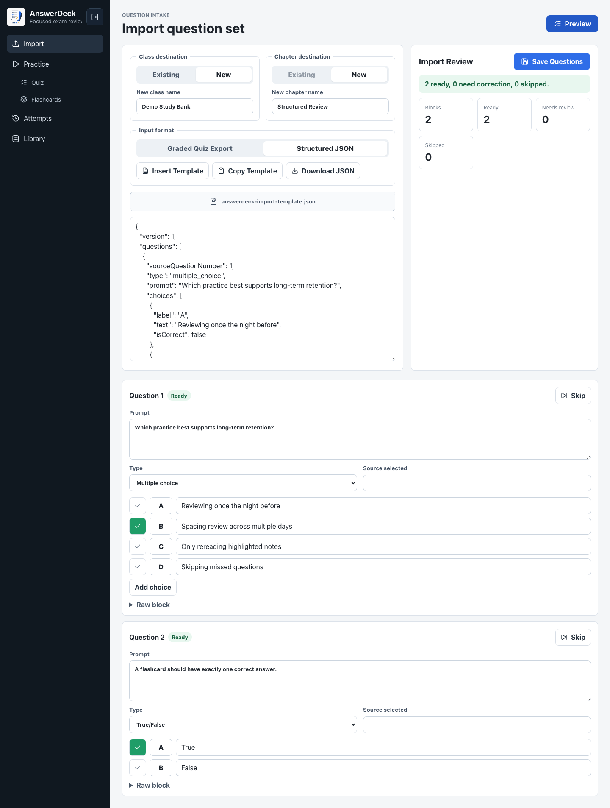
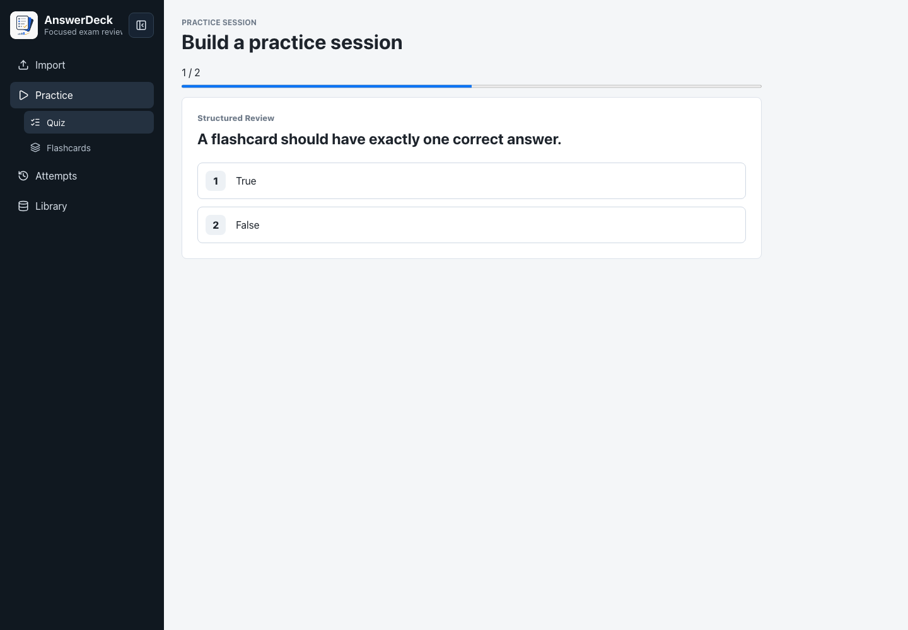
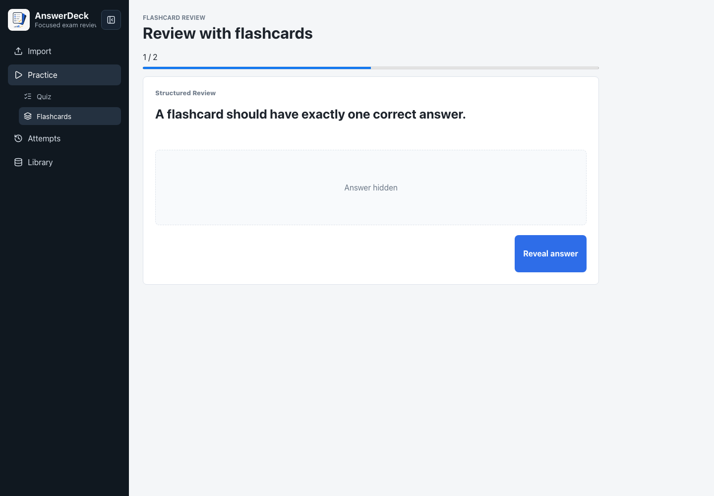
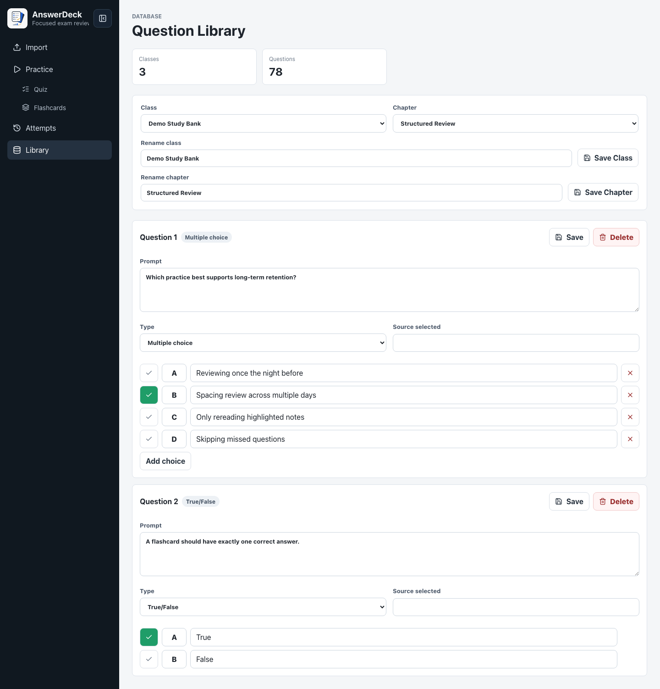
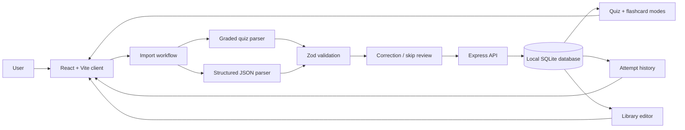

# AnswerDeck

AnswerDeck is a local-first exam review platform for turning graded quiz exports and structured question data into a verified study bank. It supports deterministic import, correction workflows, chapter-based quizzes, flashcards, attempt history, and library editing without sending study data to an external service.

## Why It Exists

Most flashcard tools assume the question bank already exists. AnswerDeck focuses on the harder workflow: taking messy graded quiz output, validating it, preserving source context, and turning it into reusable practice material.

That makes it useful for students who want to convert previous homework or review attempts into a clean study system while keeping the data local.

## Core Features

- Import from **Graded Quiz Export** text or **Structured JSON**.
- Preview parsed questions before anything is saved.
- Validate every question with Zod before it enters the study bank.
- Route incomplete or ambiguous questions to a correction/skip workflow.
- Preserve source metadata such as raw block, source file, source status, and selected wrong answer.
- Practice with single-chapter or combined-chapter quiz sessions.
- Review questions in flashcard mode with self-grading.
- Save quiz attempts with score, missed questions, and timing.
- Edit classes, chapters, prompts, choices, and correct answers in the library.

## Screenshots

### Import Review



### Quiz Mode



### Flashcard Mode



### Library Editing



## Import Formats

### Graded Quiz Export

Use this mode for pasted or uploaded `.txt` files copied from a graded homework or quiz attempt. The deterministic parser supports multiple-choice and true/false questions, including source attempts marked `INCORRECT`.

When a block cannot be parsed safely, it is shown in the correction workflow instead of being guessed into the database.

### Structured JSON

Use this mode when questions already exist in a clean format. The Import screen includes controls to insert, copy, or download the standard JSON template.

```json
{
  "version": 1,
  "questions": [
    {
      "sourceQuestionNumber": 1,
      "type": "multiple_choice",
      "prompt": "Which practice best supports long-term retention?",
      "choices": [
        { "label": "A", "text": "Reviewing once the night before", "isCorrect": false },
        { "label": "B", "text": "Spacing review across multiple days", "isCorrect": true },
        { "label": "C", "text": "Only rereading highlighted notes", "isCorrect": false },
        { "label": "D", "text": "Skipping missed questions", "isCorrect": false }
      ],
      "sourceStatus": "UNKNOWN",
      "sourceSelectedAnswer": null
    }
  ]
}
```

Supported question types:

- `multiple_choice`
- `true_false`

Each question must have at least two choices and exactly one correct answer.

## Architecture



## Tech Stack

- **Frontend:** React 19, TypeScript, Vite, plain CSS
- **Backend:** Express 5
- **Runtime:** Node with `tsx` for local development
- **Database:** SQLite through Node's built-in `node:sqlite` API
- **Validation:** Zod
- **Charts:** Recharts
- **Icons:** Lucide React
- **Testing:** Vitest and Playwright
- **Dependency policy:** exact pinned package versions

## Run Locally

```sh
nvm use
npm install
npm run dev
```

Open:

```txt
http://127.0.0.1:4173
```

Local study data is stored in:

```txt
data/study.sqlite
```

The app targets Node 24 LTS or another supported Node release that includes the built-in `node:sqlite` API. The repository includes `.nvmrc` and `.node-version` for version managers.

## Production Mode

```sh
npm run build
npm run start
```

Production mode serves the built Vite client from `dist/client` and keeps the API bound to `127.0.0.1`.

## Validation

```sh
npm ci
npm run test
npm run build
npm run test:e2e
npm run audit
```

The same checks run in GitHub Actions on pushes to `main`, and can be started manually with `workflow_dispatch`. Pull requests do not run CI automatically.

Current automated coverage includes:

- Graded quiz fixture parsing.
- Structured JSON import parsing.
- `INCORRECT` source answer handling.
- Five-option multiple-choice parsing.
- Multi-line answer preservation.
- Malformed-question correction fallback.
- Primary navigation and Practice submenu access.
- Import preview layout containment.

## Fixture Data

Generic test fixtures live in `tests/fixtures/`:

- `Study_Skills_Chapter1.txt`
- `Writing_Fundamentals_Chapter2.txt`

These files are intentionally domain-neutral so the project can be reviewed without relying on private course material.
